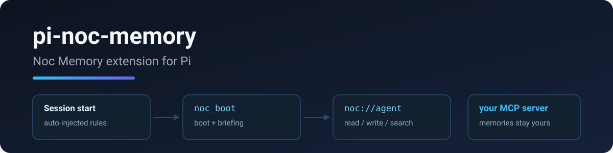

# pi-noc-memory

<p align="center">
  
</p>

**Noc Memory extension for Pi — automated memory management with SessionStart boot protocol.**

Agent-side companion to [cf-noc-mem](https://github.com/RealAlexandreAI/cf-noc-mem) (the Cloudflare-hosted MCP memory server). Also available for dsh: [dsh-noc-memory](https://github.com/RealAlexandreAI/dsh-noc-memory).

## Features

- **SessionStart Boot Protocol** — automatically calls `noc_boot` (reads `system://boot`) at session start, then `system://briefing` for today's context (recent activity, expiring memories, cold candidates)
- **Memory Rules** — global rules injected every session for intelligent memory usage (write-judgement, update-over-create, trigger discipline)
- **Memory Tools** — `noc_read`, `noc_create`, `noc_update`, `noc_delete`, `noc_search`, `noc_alias`, `noc_triggers`

## Install

```bash
pi install npm:pi-noc-memory
```

> **Upgrading from pi-nocturne-memory (≤1.0.x):** the package was renamed to `pi-noc-memory` and tools renamed from `nocturne_*` to `noc_*`. Old config at `~/.pi/agent/extensions/pi-nocturne-memory/config.json` is still read as a fallback, so your MCP URL/credentials keep working — just reinstall the new package and update any prompt text that referenced `nocturne_*` tools.

## Configure

Add to `~/.claude/rules.md` or project rules:

```markdown
- noc-memory rules (from pi-noc-memory extension)
```

Set your MCP endpoint (new path, or legacy `pi-nocturne-memory` path):

```json
{ "mcpUrl": "https://mem.example.com/mcp", "mcpAuth": "Bearer your-token" }
```

## How It Works

1. **SessionStart Hook** — triggers boot + briefing at session start
2. **Agent calls `noc_boot`** — loads `system://boot`, `system://recent/5`, glossary
3. **Agent calls `noc_briefing`** — today's working-memory briefing (if implemented by server)
4. **Global Rules** — memory operation rules injected every session
5. **Agent uses memory tools** — read/create/update/delete based on rules

## Why noc_* (not nocturne_*)?

Some agents probe for `read_mcp_resource` before reaching for a memory tool, which wastes a round trip ([upstream issue #32](https://github.com/Dataojitori/nocturne_memory/issues/32)). The `noc_boot` / `noc_read` naming, plus the boot protocol text in the rules, steers models to the right tool explicitly — no resource shim needed.

## License

MIT

## Related

- [cf-noc-mem](https://github.com/RealAlexandreAI/cf-noc-mem) — the MCP memory server this extension talks to
- [dsh-noc-memory](https://github.com/RealAlexandreAI/dsh-noc-memory) — same memory tools for dsh
- [nocturne_memory](https://github.com/Dataojitori/nocturne_memory) — upstream project
